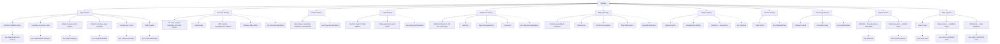

# Feature Tree

```mermaid
graph TD
    Game[Meridian]

    Game --> MapF[Map & World]
    Game --> EconF[Economy Ministry]
    Game --> BudgetF[Budget Ministry]
    Game --> TradeF[Trade Ministry]
    Game --> DipF[Diplomacy Ministry]
    Game --> MilF[Military Ministry]
    Game --> PolF[Politics Ministry]
    Game --> SocF[Society Ministry]
    Game --> TechF[Technology Ministry]
    Game --> WorldF[World Systems]
    Game --> MetaF[Meta Systems]

    MapF --> MapMode[Political / Satellite modes]
    MapF --> MapGeo[Countries, provinces, cities]
    MapF --> MapInfra[Roads, railways, ports, airports]
    MapF --> MapCross[Border crossings, water crossings]
    MapF --> MapNav[Camera pan / zoom]
    MapF --> MapClick[Click-to-select]

    MapMode -.-> MapModeNote(see: Map Modes and Coloring)
    MapGeo -.-> MapGeoNote(see: Natural Earth Datasets)
    MapInfra -.-> MapInfraNote(see: Map Rendering)
    MapCross -.-> MapCrossNote(see: Curated Datasets)
    MapNav -.-> MapNavNote(see: Camera and Input)
    MapClick -.-> MapClickNote(see: Camera and Input)

    EconF --> Taxes[Tax rates: income, corporate, VAT, tariff, custom]
    EconF --> Rate[Interest rate]
    EconF --> Indicators[GDP, growth, unemployment, inflation]
    EconF --> TreasuryF[Treasury, debt, deficit]
    EconF -.-> EconNote(see: Economy Mechanics)

    BudgetF --> SpendLevers[Spend levers: education, healthcare, infrastructure]
    BudgetF -.-> BudgetNote(see: Economy Mechanics)

    TradeF --> TradeFlow[Exports / imports / trade balance]
    TradeF --> TradeBonus[Trade agreement export bonus]
    TradeF -.-> TradeNote(see: Economy Mechanics)

    DipF --> Relations[Bilateral relations, 0-100 per country pair]
    DipF --> Aid[Send aid]
    DipF --> Agreement[Sign trade agreement]
    DipF --> Denounce[Denounce]
    DipF -.-> DipNote(see: Diplomacy Mechanics)

    MilF --> Defense[Defense spending & readiness]
    MilF --> Declare[Declare war]
    MilF --> Concessions[Demand concessions]
    MilF --> WhitePeace[Offer white peace]
    MilF -.-> MilNote(see: War Mechanics)

    PolF --> Approval[Approval rating]
    PolF --> Standing[International standing]
    PolF --> ElectionsF[Elections — 4-year term]
    PolF -.-> PolNote(see: Elections)

    SocF --> Mood[Public mood]
    SocF -.-> SocNote(see: National State)

    TechF --> Research[Research spend]
    TechF --> Innovation[Innovation index]
    TechF -.-> TechNote(see: National State)

    WorldF --> AIWorld[World AI — AI-vs-AI wars & trade deals]
    WorldF --> DecisionEv[Decision events — random crises]
    AIWorld -.-> AIWorldNote(see: World AI)
    DecisionEv -.-> DecisionEvNote(see: Decision Events)

    MetaF --> SaveF[Save / Load]
    MetaF --> HistoryF[Player history — sparkline charts]
    MetaF --> FeedF[World feed — toast headlines]
    SaveF -.-> SaveNote(see: Save Load)
    HistoryF -.-> HistoryNote(see: History and World Feed)
    FeedF -.-> FeedNote(see: History and World Feed)
```
