# Feature Tree

The game itself, broken into main features and their sub-features — as opposed to
[[Meridian|the vault's own navigation structure]], this is a map of *what the game does*, not
*how the documentation is organized*. Every leaf here links to the note that covers it in
more depth.

```mermaid
graph TD
    Game[Meridian]

    Game --> MapF[Map & World]
    Game --> EconF[Economy Ministry]
    Game --> BudgetF[Budget Ministry]
    Game --> TradeF[Trade Ministry]
    Game --> DipF[Diplomacy Ministry]
    Game --> MilF[Military Ministry]
    Game --> PolF[Politics Ministry]
    Game --> SocF[Society Ministry]
    Game --> TechF[Technology Ministry]
    Game --> WorldF[World Systems]
    Game --> MetaF[Meta Systems]

    MapF --> MapMode[Political / Satellite modes]
    MapF --> MapGeo[Countries, provinces, cities]
    MapF --> MapInfra[Roads, railways, ports, airports]
    MapF --> MapCross[Border crossings, water crossings]
    MapF --> MapNav[Camera pan / zoom]
    MapF --> MapClick[Click-to-select]

    EconF --> Taxes[Tax rates: income, corporate, VAT, tariff, custom]
    EconF --> Rate[Interest rate]
    EconF --> Indicators[GDP, growth, unemployment, inflation]
    EconF --> TreasuryF[Treasury, debt, deficit]

    BudgetF --> SpendLevers[Spend levers: education, healthcare, infrastructure]

    TradeF --> TradeFlow[Exports / imports / trade balance]
    TradeF --> TradeBonus[Trade agreement export bonus]

    DipF --> Relations[Bilateral relations, 0-100 per country pair]
    DipF --> Aid[Send aid]
    DipF --> Agreement[Sign trade agreement]
    DipF --> Denounce[Denounce]

    MilF --> Defense[Defense spending & readiness]
    MilF --> Declare[Declare war]
    MilF --> Concessions[Demand concessions]
    MilF --> WhitePeace[Offer white peace]

    PolF --> Approval[Approval rating]
    PolF --> Standing[International standing]
    PolF --> ElectionsF[Elections — 4-year term]

    SocF --> Mood[Public mood]

    TechF --> Research[Research spend]
    TechF --> Innovation[Innovation index]

    WorldF --> AIWorld[World AI — AI-vs-AI wars & trade deals]
    WorldF --> DecisionEv[Decision events — random crises]

    MetaF --> SaveF[Save / Load]
    MetaF --> HistoryF[Player history — sparkline charts]
    MetaF --> FeedF[World feed — toast headlines]
```

## Branch by branch

### [[Map Modes and Coloring|Map & World]]
- Political mode (relation-colored fills) / Satellite mode (offline basemap + live tiles) —
  [[Map Modes and Coloring]], [[Satellite Basemap]]
- Countries, provinces, cities — [[Natural Earth Datasets]]
- Roads, railways, ports, airports — [[Natural Earth Datasets]], [[Map Rendering]]
- Border crossings (computed) and water crossings (curated) — [[Curated Datasets]]
- Camera pan/zoom, click-to-select — [[Camera and Input]]

### [[Economy Mechanics|Economy Ministry]]
Tax rates (income/corporate/VAT/tariff/custom), interest rate, GDP/growth/unemployment/
inflation, treasury/debt/deficit — [[Economy System]]

### Budget Ministry
Spending levers (education/healthcare/infrastructure), part of [[Economy Mechanics]] —
[[Economy System]]

### Trade Ministry
Exports/imports/trade balance, boosted by the [[Diplomacy Mechanics|trade agreement]] export
bonus — [[Economy System]]

### [[Diplomacy Mechanics|Diplomacy Ministry]]
Bilateral relations matrix, send aid, sign trade agreement, denounce — [[Diplomacy System]]

### [[War Mechanics|Military Ministry]]
Defense spending & readiness, declare war, demand concessions, offer white peace —
[[War System]]

### [[Elections|Politics Ministry]]
Approval rating, international standing, the 4-year term/election check —
[[Player State and Elections]], [[National State]]

### Society Ministry
Public mood — [[National State]]

### Technology Ministry
Research spend, innovation index — [[National State]]

### World Systems (run without the player)
World AI (AI-vs-AI wars & trade deals) — [[World AI]]; random decision events —
[[Decision Events]]

### Meta Systems
Save/Load — [[Save Load]]; player history sparklines and the world-feed toast queue —
[[History and World Feed]]

---
See also: [[Meridian]] for the vault's own navigation tree, and [[Ministries]] for the
ministry-bar summary table.
