# Meridian

A single-player geopolitical strategy game — pick a real country, govern it, watch its economy
simulate, manage 8 ministries, win or lose elections on approval rating. Built in Unity/C# as a
port of an original Rust/Bevy prototype (kept untouched as a reference one folder up from this
project).

## 🗺️ [[Meridian Overview.canvas|Meridian Overview]]

The one-page answer to "what is this game" — a single **Canvas** board (Obsidian's native
visual board: drag, zoom, rearrange freely), not a static diagram or a wall of separate notes:
[[Meridian Overview.canvas|open Meridian Overview]]. Three sections on one board:
- **What is Meridian?** — the pitch and quick facts
- **Core Loop** — the 7-step cycle from picking a country to the next election, looping back
- **Feature Tree** — Map & World, all 8 ministries, World Systems, and Meta Systems branching
  into their sub-features, with real documentation embedded as clickable cards wherever it exists

## 🔗 [[Feature Relationships.canvas|Feature Relationships]]

The tree only shows "belongs under X ministry" — it doesn't show that Denouncing (Diplomacy)
raises your Approval Rating (Politics), or that a war (Military) drains your Treasury
(Economy). [[Feature Relationships.canvas|Open Feature Relationships]] for the cross-cutting
picture: one colored group per ministry, with labeled arrows only for connections that cross
between **different** ministries — same-ministry relationships are left out since the tree
already covers those.

## 🗓️ [[Development Roadmap.canvas|Development Roadmap]]

Neither of the boards above is chronological — both describe the game as it stands right now.
[[Development Roadmap.canvas|Open Development Roadmap]] for the build order instead: seven
stages left to right, from the geo/rendering foundation through to a tagged v1.0, with each
stage marked done / next / planned / milestone. The per-session delta (what actually shipped
since the roadmap was last touched) lives in `CLAUDE.md` at the repo root, not here.

## 🌟 [[Vision Overview|The Vision]] — where this is all headed

The three boards above describe the game **as it stands**. [[Vision Overview|Open the Vision
folder]] for the long-term ambition instead: real per-country governments and legislatures with
actual named political parties, real seeded tax data, a sector/company-level economy, the real
2026 conflict map plus terrorism and military realism, supranational unions (EU/GCC/UN), and a
long list of map/UI realism asks. This is a marathon, not a sprint — see the roadmap's stage 4.5.

## Vault map

The diagram below is a different tree — this is how *the documentation itself* is organized,
not the game's features (that's the [[Meridian Overview.canvas|Meridian Overview canvas]] above).

```mermaid
graph TD
    Root[Meridian]
    Root --> Arch[Architecture]
    Root --> Design[Game Design]
    Root --> Data[Data Sources]

    Arch --> CA[Code Architecture]
    CA --> Geo[Geo Pipeline]
    CA --> MapR[Map Rendering]
    CA --> Cam[Camera and Input]
    CA --> UI[UI System]
    CA --> Sim[Simulation Overview]

    Sim --> Econ[Economy System]
    Sim --> Nat[National State]
    Sim --> Dip[Diplomacy System]
    Sim --> War[War System]
    Sim --> AI[World AI]
    Sim --> Events[Decision Events]
    Sim --> Player[Player State and Elections]
    Sim --> Infra[Buildable Infrastructure]
    Sim --> Save[Save Load]
    Sim --> Hist[History and World Feed]

    Design --> Gameplay[Gameplay Overview]
    Design --> Min[Ministries]
    Design --> EconM[Economy Mechanics]
    Design --> DipM[Diplomacy Mechanics]
    Design --> WarM[War Mechanics]
    Design --> Elect[Elections]
    Design --> MapMode[Map Modes and Coloring]

    Data --> DSO[Data Sources Overview]
    Data --> NE[Natural Earth Datasets]
    Data --> Cur[Curated Datasets]
    Data --> Sat[Satellite Basemap]
    Data --> Flags[Country Flags]

    Root --> Vis[Vision Overview]
    Vis --> VisGov[Government, Legislature and Real Taxes]
    Vis --> VisEcon[Economic Sectors and Companies]
    Vis --> VisMil[Conflicts, Terrorism and Military Realism]
    Vis --> VisUnion[Supranational Unions]
    Vis --> VisUI[Map and UI Realism]
    Vis --> VisData[Data Accuracy Audit]
```

This vault maps the game from three angles. Pick whichever door matches what you're trying to
understand:

## 🏗️ [[Code Architecture|Architecture]] — how it's built
Start at [[Code Architecture]] for the folder-level map, then branch into whichever system you
need:
- [[Geo Pipeline]] — loading real-world countries/provinces/cities/roads from GeoJSON
- [[Map Rendering]] — turning that data into meshes, layers, and map modes
- [[Camera and Input]] — pan/zoom and click-to-select
- [[UI System]] — the entire HUD, hand-built in UI Toolkit
- [[Simulation Overview]] — the tree of Sim/ systems and how they tick together
  - [[Economy System]], [[National State]], [[Diplomacy System]], [[War System]],
    [[World AI]], [[Decision Events]], [[Player State and Elections]],
    [[Buildable Infrastructure]], [[Save Load]], [[History and World Feed]]

## 🎮 [[Gameplay Overview|Game Design]] — how it plays
- [[Gameplay Overview]] — the core loop
- [[Ministries]] — the 8 categories and what each one does
- [[Economy Mechanics]], [[Diplomacy Mechanics]], [[War Mechanics]], [[Elections]]
- [[Map Modes and Coloring]] — Political vs Satellite, and relation-based coloring

## 🌍 [[Data Sources Overview|Data Sources]] — where the world data comes from
- [[Natural Earth Datasets]] — countries, provinces, cities, ports, airports, roads, railways
- [[Curated Datasets]] — air bases, oil ports, nuclear plants, water crossings, border crossings
- [[Satellite Basemap]] — the offline Blue Marble background + live ESRI tile streaming
- [[Country Flags]] — 237 offline flag icons for the UI

---

## Quick facts
- Engine: Unity 6000.5.3f1, UI built entirely in code (UI Toolkit, no UXML/USS assets)
- Projection: Web Mercator everywhere, "degrees-normalized" (see [[Geo Pipeline]])
- 258 countries, 4,596 provinces, 7,342 cities, ~34k road features, ~9k railway features
- Headless build pipeline: `Tools\build.ps1 -Mode compile` / `-Mode build` — no Editor UI needed
- Reference implementation (do not edit): the original Rust/Bevy build, one folder up
