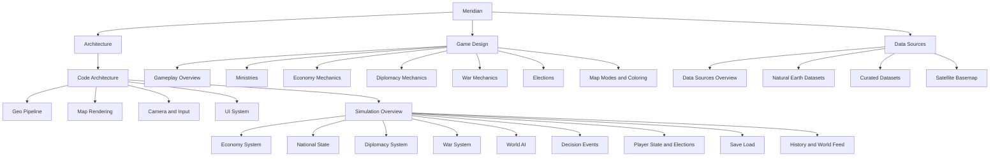

# Meridian

A single-player geopolitical strategy game — pick a real country, govern it, watch its economy
simulate, manage 8 ministries, win or lose elections on approval rating. Built in Unity/C# as a
port of an original Rust/Bevy prototype (kept untouched as a reference one folder up from this
project).

## Vault map

This vault maps the game from three angles. Pick whichever door matches what you're trying to
understand:

## 🏗️ [[Code Architecture|Architecture]] — how it's built
Start at [[Code Architecture]] for the folder-level map, then branch into whichever system you
need:
- [[Geo Pipeline]] — loading real-world countries/provinces/cities/roads from GeoJSON
- [[Map Rendering]] — turning that data into meshes, layers, and map modes
- [[Camera and Input]] — pan/zoom and click-to-select
- [[UI System]] — the entire HUD, hand-built in UI Toolkit
- [[Simulation Overview]] — the tree of Sim/ systems and how they tick together
  - [[Economy System]], [[National State]], [[Diplomacy System]], [[War System]],
    [[World AI]], [[Decision Events]], [[Player State and Elections]], [[Save Load]],
    [[History and World Feed]]

## 🎮 [[Gameplay Overview|Game Design]] — how it plays
- [[Gameplay Overview]] — the core loop
- [[Ministries]] — the 8 categories and what each one does
- [[Economy Mechanics]], [[Diplomacy Mechanics]], [[War Mechanics]], [[Elections]]
- [[Map Modes and Coloring]] — Political vs Satellite, and relation-based coloring

## 🌍 [[Data Sources Overview|Data Sources]] — where the world data comes from
- [[Natural Earth Datasets]] — countries, provinces, cities, ports, airports, roads, railways
- [[Curated Datasets]] — air bases, oil ports, nuclear plants, water crossings, border crossings
- [[Satellite Basemap]] — the offline Blue Marble background + live ESRI tile streaming

---

## Quick facts
- Engine: Unity 6000.5.3f1, UI built entirely in code (UI Toolkit, no UXML/USS assets)
- Projection: Web Mercator everywhere, "degrees-normalized" (see [[Geo Pipeline]])
- 258 countries, 4,596 provinces, 7,342 cities, ~34k road features, ~9k railway features
- Headless build pipeline: `Tools\build.ps1 -Mode compile` / `-Mode build` — no Editor UI needed
- Reference implementation (do not edit): the original Rust/Bevy build, one folder up
